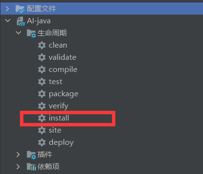

## 目录

- [**项目背景**](#项目背景)
- [**安装**](#安装)
- [**使用方式**](#使用方式)
- [**示例**](#示例)

## **项目背景**

本项目使用到了java版本的大模型SDK，仓库路径：[AI-java](https://github.com/mainpropath/AI-java)

随着深度学习和人工智能的迅速发展，各个厂商纷纷推出了强大的大模型，这些大模型在语言生成、图像识别、自然语言处理等领域取得了巨大的成功。然而，不同厂商之间的大模型往往采用不同的架构和接口，使得开发者在应用这些模型时面临一些挑战。

为了解决这个问题，我们提出了一个全新的大模型应用框架，旨在将不同厂商之间的大模型结合起来使用。这个框架可以灵活地支持多种使用模式。如链路模式、代理模式、存储模式、提示工程和模型基座，以满足不同用户的需求。

链路模式：可将多个不同厂商的模型统一到同一条链路上，相互合作完成功能。并且可以自由组合链路上的节点。

代理模式：与模型交互后，模型与代理模型进行交互，多次交互后返回更加精准的回复。

提示工程：可自由灵活的设置模型的提示词，动态替换掉关键词信息。

模型基座：考虑到不同厂商的模型实现方式不同，在模型调用和链路节点之间增加一层，向下屏蔽掉不同的模型调用方式，向上表现出统一的API口径。

## **安装**

将项目下载到本地后install。

## **使用方式**

目前还处于开发阶段

## **示例**

暂无

