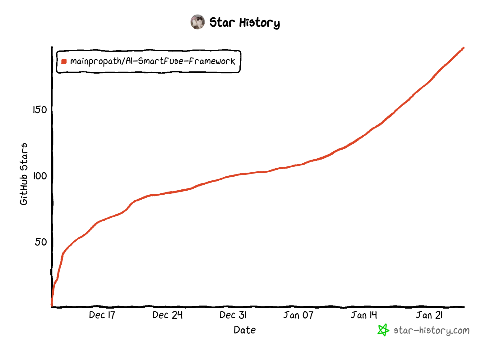

## 目录

- [**项目背景**](#项目背景)
- [**安装**](#安装)
- [**目前主要功能**](#目前主要功能)
- [**其他示例**](#其他示例)

## **项目背景**



**本项目使用到了java版本的大模型SDK，仓库路径：[AI-java](https://github.com/mainpropath/AI-java)**

随着深度学习和人工智能的迅速发展，各个厂商纷纷推出了强大的大模型，这些大模型在语言生成、图像识别、自然语言处理等领域取得了巨大的成功。然而，不同厂商之间的大模型往往采用不同的架构和接口，使得开发者在应用这些模型时面临一些挑战。

为了解决这个问题，我们提出了一个全新的大模型应用框架，旨在将不同厂商之间的大模型结合起来使用。这个框架可以灵活地支持多种使用模式。如链路模式、代理模式、存储模式、提示工程和模型基座，以满足不同用户的需求。

链路模式：可将多个不同厂商的模型统一到同一条链路上，相互合作完成功能。并且可以自由组合链路上的节点。

代理模式：与模型交互后，模型与代理模型进行交互，多次交互后返回更加精准的回复。

提示工程：可自由灵活的设置模型的提示词，动态替换掉关键词信息。

模型基座：考虑到不同厂商的模型实现方式不同，在模型调用和链路节点之间增加一层，向下屏蔽掉不同的模型调用方式，向上表现出统一的API口径。

## **安装**

将项目下载到本地后install后，将引入pom文件当中。

## [**目前主要功能**](#目前主要功能)

目前本框架已接入openai相关模型，国内大模型待接入中。

### **对话链 ConversationalChain**

**创建对话链**，其中 chatModel 为使用的对话模型。historyRecorder 为历史上下文记录器。对于 historyRecorder 而言，其底层的消息存储器 ChatMemoryStore 可以共用。即
historyRecorder 与 ChatMemoryStore 可以是一对一，也可以是一对多的关系。具体可阅读源码体会。

```java
ConversationalChain conversationalChain = ConversationalChain.builder()
        .chatModel(new OpenaiChatModel())// 对话模型
        .historyRecorder(OpenaiChatHistoryRecorder.builder().build())// 历史消息记录器
        .build();
```

**开始对话**，ConversationalChain 自带记录历史对话功能，其记录方式跟具体的historyRecorder实例有关。historyRecorder 通过内部的 ChatMemoryStore 存放对话信息。

```java
String res1 = conversationalChain.run("你好，请记住我的名字叫做小明");
System.out.println(res1);// 你好，小明！很高兴认识你。
String res2 = conversationalChain.run("我的名字是什么？");
System.out.println(res2);// 你的名字是小明。
```

测试用例路径：[ConversationalChainTest.java](https://github.com/mainpropath/AI-SmartFuse-Framework/blob/master/smartFuse-openai/src/test/java/com/ai/openai/chain/ConversationalChainTest.java)

### **对话检索链 ConversationalRetrievalChain**

对话检索链可导入 txt、excel、word、ppt、pdf、html 当中的数据作为对话时的数据依据。其步骤如下：

1. **加载数据文件：**从文件系统或者网络中读取支持的数据格式，解析为文本。
2. **读取其中的文本：**将文件当中的文本数据封装为Document。
3. **文本分割：**对于文本数据而言，往往其内容是比较大的，需要对文本进行分割。
4. **文本向量化：**将分割过后的文本进行向量化，封装为Embedding存储到EmbeddingStore当中，并且可进行持久化操作。
5. **问句向量化：**将用户询问的问题进行向量化。
6. **选择相关性最高的文本：**在文本向量中匹配出与问句向量最相似的 `top k`个文本。
7. **模板替换：**匹配出的文本作为上下文和问题一起添加到 `prompt`中。
8. **发起请求：**将问题提交给 `LLM`生成回答。

**创建向量数据导入器**，加载文件并进行向量化，将数据存储到 EmbeddingMemoryStore 当中。

```java
// 测试文件路径
String[] filePath = {"filePath1","filePath2","filePath3"};
// 创建嵌入数据导入器，这里可以设置你指定的存储器，也可以直接使用其中默认的存储器。
OpenaiEmbeddingStoreIngestor ingestor = OpenaiEmbeddingStoreIngestor.builder().build();
List<Document> documents = new ArrayList<>();
// 导入数据并放入List当中
for (String file : filePath) {
	// 导入数据封装为Document
    documents.add(FileSystemDocumentLoader.loadDocument(toPath(file)));
}
// 将数据导入到存储器当中，其中自动进行文本分割和向量化处理
ingestor.ingest(documents);
```

**创建对话检索链**，模板替换过程将会交给程序自动完成。

```java
ConversationalRetrievalChain conversationalRetrievalChain = ConversationalRetrievalChain.builder()
        .chatModel(new OpenaiChatModel())// 设置对话模型
        .embeddingModel(new OpenaiEmbeddingModel())// 设置向量化模型
        .historyRecorder(OpenaiChatHistoryRecorder.builder().build())// 设置历史消息记录器
        .retriever(OpenaiEmbeddingStoreRetriever.builder().embeddingMemoryStore(ingestor.getStore()).build())// 设置向量数据检索器，注意，检索器当中设置了对应的向量数据存储器
        .build();
```

**开始对话**，自动根据向量化后的数据选取相关性最高的文本片段作为依据进行回答。默认情况下：相关性大于 0.7 的前 2 个文本片段将会作为对话依据。

```java
String question = "询问的问题";
String res = conversationalRetrievalChain.run(question);
System.out.println(res);
```

测试用例路径：[ConversationalRetrievalChainTest.java](https://github.com/mainpropath/AI-SmartFuse-Framework/blob/master/smartFuse-openai/src/test/java/com/ai/openai/chain/ConversationalRetrievalChainTest.java)

## **其他示例**

### **模板替换**

模板替换可预先设置模板，根据关键字替换文本当中的内容。

**创建模版**

```java
// 提示词模板，需要替换的地方用{{}}包括，其中 key 为 money
String promptTemplateString = "我有一辆价值{{money}}的车，它的品牌是：{{brand}}。";
// 提示词的名称，标识这个提示词是干什么的
String templateName = "汽车提示词";
SimplePromptTemplate simplePromptTemplate = new SimplePromptTemplate(promptTemplateString, templateName);
```

**替换内容 — apply 方法**

```java
Map<String, String> map = new HashMap<>();
map.put("money", "100万");
map.put("brand", "宝马");
// 传入一个包含关键字的Map，返回一个应用示例。其中会记录其对应的模板信息
SimplePrompt apply = simplePromptTemplate.apply(map);
System.out.println(apply);// SimplePrompt(text=我有一辆价值100万的车，它的品牌是：宝马。)
System.out.println(apply.text());// 我有一辆价值100万的车，它的品牌是：宝马。
System.out.println(apply.getPromptTemplate());// SimplePromptTemplate{template='我有一辆价值{{money}}的车，它的品牌是：{{brand}}。', promptName='汽车提示词', renderMap={}}
```

**替换内容 — render 方法**

```java
Map<String, String> map = new HashMap<>();
map.put("money", "50万");
map.put("brand", "奔驰");
// 直接渲染，返回字符串
String render = simplePromptTemplate.render(map);
System.out.println(render);// 我有一辆价值50万的车，它的品牌是：奔驰。
```

```java
// 将需要渲染的数据跟模板进行绑定
simplePromptTemplate.add("money", "50万");
simplePromptTemplate.add("brand", "奔驰");
String render = simplePromptTemplate.render();
System.out.println(render);
```

测试用例路径：[PromptTest.java](https://github.com/mainpropath/AI-SmartFuse-Framework/blob/master/smartFuse-domain/src/test/java/com/ai/domain/prompt/PromptTest.java)

### **文件加载**

文件加载可加载html、txt、pdf、word、excel、ppt当中的文本信息。对外暴露成统一的方法，在方法内部判断加载文件的类型，选择不同的文件加载器。

```java
String[] filePaths = {
        "文件路径\\中文测试.txt",
        "文件路径\\中文测试.docx",
        "文件路径\\中文测试.pdf",
        "文件路径\\中文测试.xlsx",
        "文件路径\\中文测试.pptx"
};
for (String filePath : filePaths) {
    Document document = FileSystemDocumentLoader.loadDocument(filePath);
    System.out.println(document.text());// 输出加载的文本数据
    System.out.println(document.metadata());// 输出文本元数据，包括文件路径等
}
```

测试用例路径：[DocumentTest.java](https://github.com/mainpropath/AI-SmartFuse-Framework/blob/master/smartFuse-domain/src/test/java/com/ai/domain/document/DocumentTest.java)

### **文本拆分**

文本拆分可将大型文本拆分，支持的拆分粒度为：块、段、句、词。

```java
DocumentByCharacterSplitter documentByCharacterSplitter = new DocumentByCharacterSplitter(1000, 1);
String[] split = documentByCharacterSplitter.split(document.text());
```

测试用例路径：[SplitterTest.java](https://github.com/mainpropath/AI-SmartFuse-Framework/blob/master/smartFuse-domain/src/test/java/com/ai/domain/document/SplitterTest.java)

### **对话消息存储**

对话消息存储存在两个角色：记录器（Recorder ）和存储器（ChatMemoryStore）。

对话消息记录器 Recorder 从某一个对话消息存储器 ChatMemoryStore 当中获取数据。

记录器通过操作存储器来达到消息的记录效果。具体效果请参考测试用例。

测试用例路径：[ChatMemoryTest.java](https://github.com/mainpropath/AI-SmartFuse-Framework/blob/master/smartFuse-openai/src/test/java/com/ai/openai/memory/chat/ChatMemoryTest.java)

### **向量化消息存储**

向量化消息存在三个角色，导入器（Ingestor）、检索器（Retriever）、存储器（EmbeddingMemoryStore）。

导入器负责读取文件信息导入到存储器当中，检索器负责检索存储器当中的数据。具体请参考测试用例。

测试用例路径：[EmbeddingMemoryTest.java](https://github.com/mainpropath/AI-SmartFuse-Framework/blob/master/smartFuse-openai/src/test/java/com/ai/openai/memory/embedding/EmbeddingMemoryTest.java)
